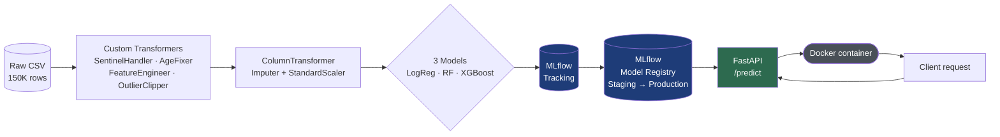
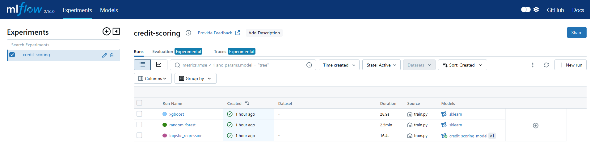
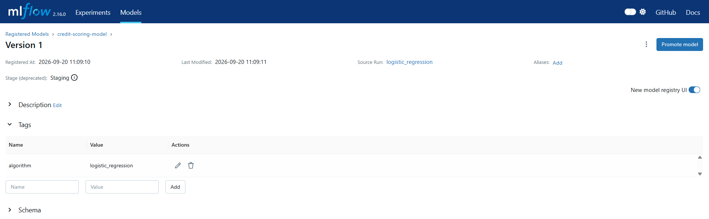
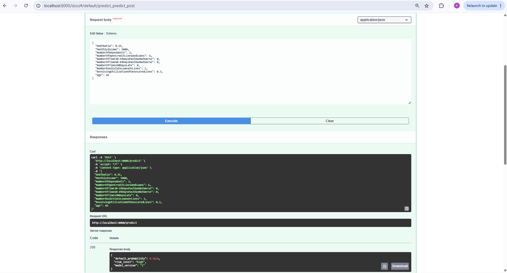
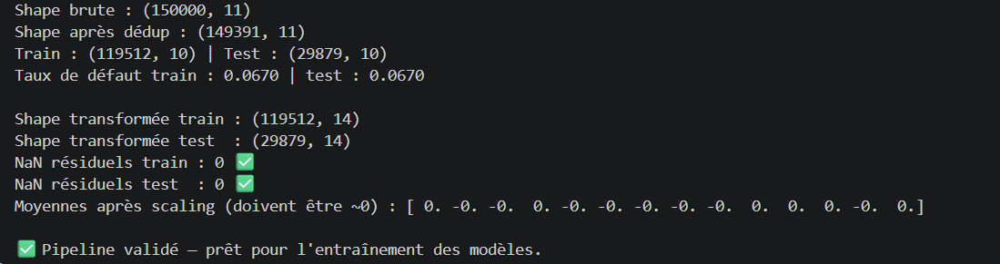
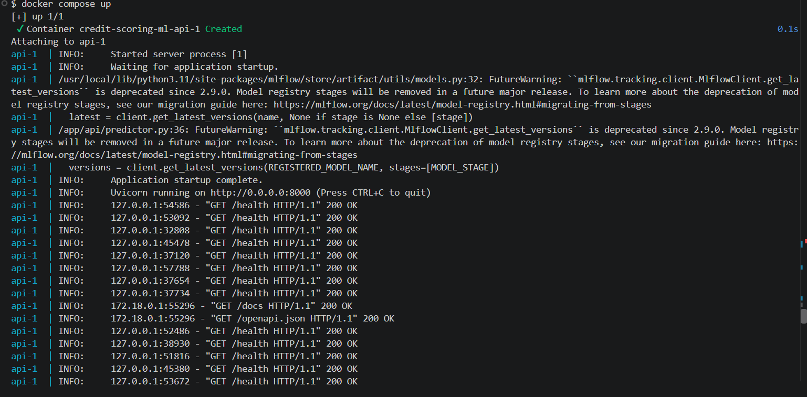

# Credit Scoring System — End-to-End ML Pipeline

An end-to-end machine learning pipeline that predicts the probability of a borrower defaulting on payment within 2 years, from raw data to a deployed, containerized REST API.

Built as a portfolio project to demonstrate production-oriented ML engineering practices: reproducible preprocessing, experiment tracking, model versioning, and API deployment.

## Overview

| Stage | What happens |
|---|---|
| **Data** | [Give Me Some Credit](https://www.kaggle.com/c/GiveMeSomeCredit/data) (Kaggle) — 150K borrower records, ~7% default rate |
| **Preprocessing** | Custom Scikit-learn transformers handling structural data-quality issues (sentinel codes, missing income, outliers) |
| **Modeling** | Logistic Regression, Random Forest, XGBoost — compared on PR-AUC, not accuracy (severe class imbalance) |
| **Tracking** | MLflow experiment tracking + Model Registry (Staging/Production workflow) |
| **Serving** | FastAPI REST API with Pydantic request validation |
| **Deployment** | Docker + docker-compose |

## Architecture



## Screenshots

*(Run the pipeline locally and drop your own screenshots into `docs/screenshots/`, then this section renders them automatically on GitHub.)*

**MLflow — experiment comparison** (`mlflow ui` → Experiments tab, all 3 runs, sorted by `pr_auc`)
```markdown

```

**MLflow — Model Registry** (Models tab → `credit-scoring-model` → version 1, stage `Staging`)
```markdown

```

**FastAPI — interactive docs** (`http://localhost:8000/docs`, `/predict` expanded with the example payload)
```markdown

```

**Terminal — pipeline validation** (`check_pipeline.py` output showing 0 residual NaN and stratification check)
```markdown

```

**Docker — container running** (`docker compose up` logs + a successful `curl /predict` response)
```markdown

```

## Project structure


```
credit-scoring-ml/
├── data/
│   ├── raw/                  # cs-training.csv goes here (not included, see below)
│   └── processed/
├── src/
│   ├── config.py             # centralized paths & constants
│   ├── data/
│   │   └── preprocessing.py  # assembles the full sklearn Pipeline
│   ├── features/
│   │   └── engineering.py    # custom transformers (sentinel handling, outliers, feature creation)
│   └── models/
│       ├── train.py              # trains & compares the 3 models, logs to MLflow
│       └── register_best_model.py # registers the best run in the Model Registry
├── api/
│   ├── main.py                # FastAPI app (/predict, /health)
│   ├── schemas.py             # Pydantic request/response models
│   └── predictor.py           # loads model from MLflow Registry, runs inference
├── check_pipeline.py          # standalone script to sanity-check the preprocessing pipeline
├── Dockerfile
├── docker-compose.yml
├── requirements.txt
└── .gitignore
```

## Dataset

This project uses the [**Give Me Some Credit**](https://www.kaggle.com/c/GiveMeSomeCredit/data) dataset from Kaggle (150,000 rows, 10 features, binary target `SeriousDlqin2yrs`).

The raw CSV is **not included** in this repository (Kaggle competition data license). To reproduce:
1. Download `cs-training.csv` from the link above
2. Place it at `data/raw/cs-training.csv`

**Known data-quality issues handled in preprocessing:**
- ~20% missing values in `MonthlyIncome`
- Sentinel codes (96/98) in the three "days past due" columns, standing in for a different meaning than a literal count
- `age = 0` (single row, data entry error)
- Extreme outliers in `RevolvingUtilizationOfUnsecuredLines` and `DebtRatio`
- 609 exact duplicate rows

## Setup

```bash
python3 -m venv .venv
source .venv/bin/activate        # Windows: .venv\Scripts\activate
pip install -r requirements.txt
```

Place `cs-training.csv` in `data/raw/`, then sanity-check the pipeline:

```bash
python check_pipeline.py
```

## Running the pipeline

**1. Train and compare models** (logs to MLflow — params, metrics, serialized pipeline):
```bash
python -m src.models.train
```

**2. Explore experiments in the MLflow UI:**
```bash
mlflow ui
# → http://localhost:5000
```

**3. Register the best model** (selected by PR-AUC) in the Model Registry, promoted to `Staging`:
```bash
python -m src.models.register_best_model
```

**4. Serve the model via the API:**
```bash
uvicorn api.main:app --reload
# → http://localhost:8000/docs
```

## Running with Docker

```bash
docker compose build
docker compose run --rm api python -m src.models.train
docker compose run --rm api python -m src.models.register_best_model
docker compose up
```

> **Note:** training is run *inside* the container (not just the API) so that MLflow's file-based artifact paths are recorded natively for the container's filesystem. A local `mlruns/` created on the host (e.g. on Windows) bakes in host-specific absolute paths that won't resolve once mounted into a Linux container — retraining inside Docker avoids this cross-environment portability issue.

## API usage

```bash
curl -X POST http://localhost:8000/predict \
  -H 'Content-Type: application/json' \
  -d '{
    "RevolvingUtilizationOfUnsecuredLines": 0.3,
    "age": 45,
    "NumberOfTime30-59DaysPastDueNotWorse": 0,
    "DebtRatio": 0.25,
    "MonthlyIncome": 5000,
    "NumberOfOpenCreditLinesAndLoans": 6,
    "NumberOfTimes90DaysLate": 0,
    "NumberRealEstateLoansOrLines": 1,
    "NumberOfTime60-89DaysPastDueNotWorse": 0,
    "NumberOfDependents": 2
  }'
```

```json
{
  "default_probability": 0.3624,
  "risk_level": "high",
  "model_version": "1"
}
```

`MonthlyIncome` and `NumberOfDependents` are optional — the pipeline's imputers handle missing values the same way they did during training.

## Model results

Selection metric: **PR-AUC** (average precision), chosen over accuracy and ROC-AUC because the target is heavily imbalanced (~7% positive class) and PR-AUC better reflects performance on the minority class that actually matters for this problem.

| Model | PR-AUC | ROC-AUC | Recall | Precision |
|---|---|---|---|---|
| **Logistic Regression** 🏆 | **0.359** | 0.820 | 0.641 | 0.255 |
| Random Forest | 0.354 | 0.841 | 0.156 | 0.545 |
| XGBoost | 0.348 | 0.833 | 0.651 | 0.245 |

All three models use `class_weight="balanced"` (or `scale_pos_weight` for XGBoost) rather than SMOTE, to avoid the data-leakage risk of resampling before the train/test split.

## Design notes

- **Single sklearn `Pipeline` object** (custom transformers → `ColumnTransformer` → classifier) fitted only on train data — no data leakage between train/test, and the exact same object is serialized and reused for inference in the API.
- **Custom transformers** (`SentinelHandler`, `OutlierClipper`, `AgeFixer`, `FeatureEngineer`) are unit-testable in isolation and encode the EDA findings as explicit, documented logic rather than one-off notebook cleanup.
- **Model loaded by name + stage** (`models:/credit-scoring-model/Staging`), not by a hardcoded run ID — promoting a new model version in the Registry requires no code change to the API.

## Tech stack

Python, Pandas, Scikit-learn, XGBoost, MLflow, FastAPI, Pydantic, Docker, docker-compose

## Possible next steps

- Hyperparameter tuning (GridSearchCV / Optuna) — current results use default hyperparameters
- Decision-threshold tuning per business cost (false negative vs. false positive cost)
- CI/CD pipeline for automated retraining and testing
- Centralized MLflow tracking server (replacing the local file store) for true multi-environment portability

## Author

Khalid Iktib — [LinkedIn](https://www.linkedin.com/in/khalid-iktib-022531333/) · [GitHub](https://github.com/khalidiktib)